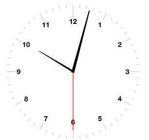

# Python Clock

### The clock in the classroom has broken! How will we know when it's time to go home?

This is a project to use Python turtles to generate a clock which we can display on the screen to show everyone what the time is. 

The first part of the project shows how to find out what the exact time is, and display it as a digital clock.

The more exciting part of the project is to use Python turtles to draw an old-fashioned analogue clock on the screen and have the hands move to show the time. You will be able to use your knowledge to design a personalised clock with your choice of lettering and style of hands.

### Let's get started...

[Go to Step 1](Step1-Whats_the_time)

