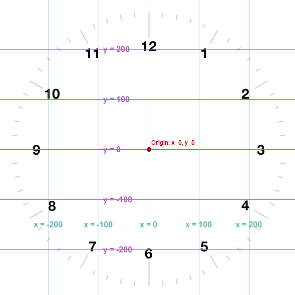

# Making the minute and hour hands

To make the minute and hour hands we will need to design shapes for these hands, using x and y coordinates to specify the corners.

Here is code to make a sample minute hand, using a turtle which we will call minute_hand and a shape called "minute hand":
```
screen.register_shape("minute hand", ((-20,-15), (20,-15), (25,170), (-25, 170)))
minute_hand = Turtle()
minute_hand.color("black")
minute_hand.shape("minute hand")
```
If you add this code just after the code which makes the second hand and run it you should see that your clock has a second hand and a very ugly, oversized minute hand.


 

