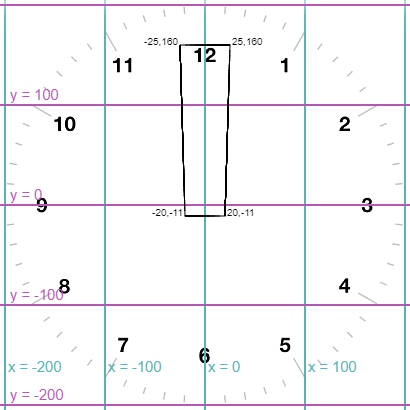

# Making the minute and hour hands (trinket)

To make the minute and hour hands we will need to design shapes for these hands, using x and y coordinates to specify the corners.

Here is code to make a minute hand, using a turtle which we will call ```minute_hand``` and a shape called "minute hand". Add this code just after the code which creates the second hand turtle:

```python
s.register_shape("minute hand", ((-20,-11), (20,-11), (25,160), (-25, 160)))
minute_hand = Turtle()
minute_hand.color("black")
minute_hand.shape("minute hand")
```

If you save and run your code you should see that your clock has a moving second hand and a rather **ugly**, oversized minute hand pointing to 3 o'clock.

Change the coordinates in the ```screen.register_shape()``` line of code to make a better shape. To understand what the coordinates mean look at this picture of the clock with the x and y coordinates of the minute hand marked. You need to select x and y values of corner points to make a thinner, more elegant minute hand. Remember the centre of the clock is at x=0, y=0.

 

Once you have a nice-looking minute hand you can use very similar code to make an hour hand. The hour hand in a clock is usually a bit fatter and a bit shorter.

```python
screen.register_shape("hour hand", (your list of coordinates for the hour hand in the brackets))
hour_hand = Turtle()
hour_hand.color("black")
hour_hand.shape("hour hand")
```

**IF YOU COPY THIS CODE** - make sure you add in your coordinates for the hour hand before you try to run it.

If you want to check what your hour hand looks like without seeing the minute hand you can temporarily hide the minute hand turtle by adding the code ```minute_hand.hideturtle()```. Take this line out again afterwards.

[Continue to Step 6 - Making the minute and hour hands move](../Step6-Making-the-hands-move/README_trinket.md)

[Go back to previous page](../Step5-Adding-minute-and-hour-hands/README_trinket.md)
