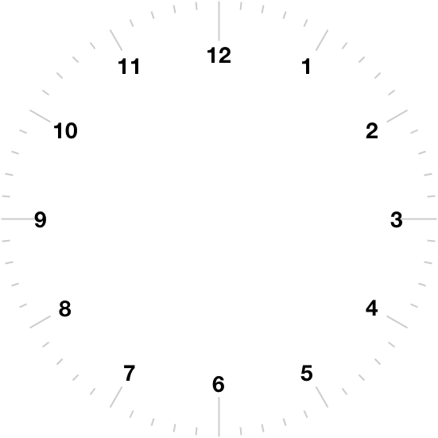

## 2. Draw tick marks round the outside

The ```blank_clock.gif``` image we used before for the clock background had three different type of tick marks - long ticks at 12, 3, 6, and 9 positions; medium length ticks at all the other numbers; and short ticks at all the seconds positions. (The thicknesses of the different types of tick may also be slightly different.)

 

We want to draw these three different types of ticks on our custom clock background. Let's start with little ticks to mark every second.

### Draw ticks at the seconds positions

First - how long should they be? You can give the tick length by the number of pixels, but a better way is to make them a fraction of the radius - that way, if you make the clock bigger the ticks will automatically get bigger in the same proportion. We'll put this fraction in a variable called ```tick_len```. The *actual* length of the tick in pixels will be calculated by Python using a formula ```tick_len * clock_radius```.

Second - how thick should the ticks be? Again it's a good idea to give this as a fraction of the radius. We'll put this fraction in a variable called ```tick_thick``` and the *actual* thickness of the tick in pixels will be calculated by Python using a formula ```tick_thick * clock_radius```..

Third - we need to choose a colour for the ticks. We will use another variable for the colour, and call it ```tick_col```.

Fourth - how many ticks do we want? If we are drawing ticks for every second then we want 60. We'll put this number in a variable called ```num_ticks```.

Now we'll use our drawing turtle to draw one tick at the 12 o'clock position. Here are the first few lines, with comments to explain what each line does:

Put this code after the code for drawing the circle.

```
tick_len = ? # the fraction of the circle radius to use for the tick length. You could try 0.1 to start with.

tick_thick = ? # the fraction of the circle radius to use for the tick thickness. You could try 0.01 to start with.
grid_turtle.pensize(pen_thick * clock_radius) # this sets the pen thickness as a fraction of the clock radius

tick_col = *** # choose your preferred colour for the ticks - don't forget the quote marks
grid_turtle.pencolor(tick_col) # this sets the turtle's colour to your choice

num_ticks = 60 # this is the number of ticks - it's 60 for all the seconds positions

grid_turtle.home() # this sends the turtle to the middle of the clock
grid_turtle.setheading(0) # this makes sure the turtle is pointing up
grid_turtle.penup() # this makes sure the turtle won't start drawing yet
```
Next we want to move the turtle out towards the edge of the clock before we draw the tick. **_How do we work out how far the turtle has to move?_**

Well, if ```tick_len = 0.1``` then our tick is going to be one tenth of the radius long, so we need the turtle to move *nine* tenths of the radius before drawing. That way, at the end of the tick the turtle will have reached the edge of the clock. The amount the turtle moves before drawing, plus the length of the tick must add up to the radius of the clock.

Put another way, if we give the length of the tick as a fraction of the radius, then the fraction the turtle moves **before** drawing **plus** the fraction for drawing the tick must add up to 1. Add this code after the lines you've just added.
```
grid_turtle.forward(?) # this moves the turtle towards the edge of the clock
```
You need to work out what to put in the brackets. It will be a quantity multiplied by the clock's radius, but what quantity?

Go [here](README3.md) for a hint.

Now we put the turtle pen down, then we move forward while drawing the tick (again you have to put the formula in the brackets) then put the pen up again, and finally return back to the middle of the clock. Add these lines after the lines you've just added.
```
grid_turtle.pendown() # this gets the turtle ready for drawing
grid_turtle.forward(?) # you must give the turtle for formula for how far to move
grid_turtle.penup()
grid_turtle.home() # send the turtle back to the middle of the clock
```
Save and run the code. Hopefully there's now a tick at the top of the clock. You can adjust the length and thickness by changing the variables ```tick_len``` and ```tick_thick```.

(OK, I know we wanted a **long** tick at the 12 o'clock position. We will draw the shortest ticks first, then add longer ticks later on top of the short ticks, so at the end you will only see the long one at the 12.)

[Continue to next section *Draw ticks at all the seconds positions*](README4.md)

[Go back to previous page](README.md)